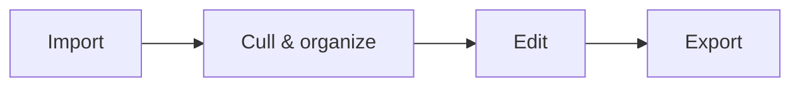

Ansel is a **non-destructive RAW photo editor**. It never modifies your original files: every change is stored as a recipe (an editing _history_) in a [library](library.md) database, and only written out to a real image file when you [export](../views/toolboxes/export.md). This means your originals stay safe, edits are reversible forever, and the same recipe can be applied to many images at once.

This section is a quick bootstrap. Each step links to a more detailed page and to the relevant [view](../views/_index.md).

## The four-step workflow

### 1. Import

Tell Ansel about your images. From the [global menu](../views/global-menu.md), choose _File → Import…_ (<kbd>Ctrl</kbd>+<kbd>Shift</kbd>+<kbd>I</kbd>). You can either reference images where they already are, or copy them off a memory card into a tidy folder structure as you import.

More details: [Import images](import.md)

### 2. Cull and organize

Imported images appear as thumbnails in the [lighttable](../views/lighttable/_index.md). This is where you sort the keepers from the rest: assign **star ratings** (<kbd>0</kbd>–<kbd>5</kbd>), **reject** (<kbd>R</kbd>) or **color labels** (<kbd>F1</kbd>–<kbd>F6</kbd>), add tags and metadata, and narrow the view down to exactly the images you want with the [collection filters](library.md) and the _Library_ tool.

To act on images — rate them, tag them, copy an edit onto them — you first **select** them with a click or a keystroke. Selection is deliberate and explicit, so nothing changes by accident.

More details: [Library and collections](library.md) · [Image selection](selection.md)

### 3. Edit

Double-click a thumbnail (or select it and press <kbd>Enter</kbd>) to open it in the [darkroom](../views/darkroom/_index.md). The image-processing [modules](../views/darkroom/modules/_index.md) sit in the right panel, grouped into workflow tabs that follow the [pixelpipe](../views/darkroom/pixelpipe/_index.md). Editing left-to-right across the tabs, and bottom-to-top within them, walks you through a sound order of operations.

There is **no save button**: every change is recorded automatically into the history. You can step back at any time with <kbd>Ctrl</kbd>+<kbd>Z</kbd>, or revisit any past state from the [history of changes](../views/toolboxes/history-stack.md).

More details: [Editing images](editing.md)

### 4. Export

Apply the history to the original to produce a final file. Select the images and choose _File → Export…_ (<kbd>Ctrl</kbd>+<kbd>Shift</kbd>+<kbd>E</kbd>) to render them to JPEG, TIFF and other formats. You can also reuse an edit across a whole shoot by copying its history or saving it as a [style](../views/toolboxes/styles.md).

More details: [Export](../views/toolboxes/export.md)

## Finding your way around

A few things worth knowing before you start:

- **Views.** Ansel is split into [views](../views/_index.md) — _lighttable_ for browsing, _darkroom_ for editing, plus optional map, print and slideshow. Switch views from the **Ateliers** menu; return to the lighttable from anywhere with <kbd>Escape</kbd>.
- **The menu bar is the backbone.** Most application-wide commands live in the [global menu](../views/global-menu.md) at the top of the window. Press <kbd>Alt</kbd> to reveal each menu's keyboard mnemonic.
- **Keyboard or mouse, your choice.** The whole interface can be driven from either. The [global action search](keyboard.md#vimkey-like-global-action-search) (<kbd>Ctrl</kbd>+<kbd>P</kbd>) finds and triggers any command by name.

More details: [Shortcuts and keyboard interaction](keyboard.md)

## Coming from another editor?

If you are migrating from Darktable, the [from Darktable](../from-darktable.md) page summarizes what changed. The short version: selection is explicit (hovering never changes anything), and the GUI is organized around the menu bar and pipeline-ordered module tabs rather than customizable icon groups.
