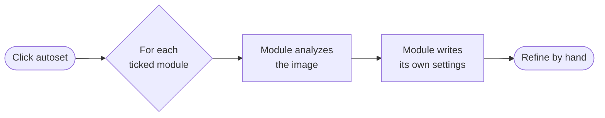

The darkroom view is where you develop a single image. The center area shows the picture currently being edited; the [left panel](darkroom-view-layout.md#left-panel) holds peripheral tools (navigation, scopes, snapshots, history…), and the [right panel](darkroom-view-layout.md#right-panel) holds the image-processing modules.

Open the darkroom from the [lighttable](../lighttable/_index.md) by double-clicking a thumbnail, or by selecting an image and pressing <kbd>Enter</kbd>. Return to the lighttable with <kbd>Escape</kbd> (or the home button in the header). You can switch to another image without leaving the darkroom by enabling the [filmstrip](../toolboxes/filmstrip.md) (<kbd>Ctrl</kbd>+<kbd>Shift</kbd>+<kbd>F</kbd>) and clicking a thumbnail in it.

How an image is processed is the subject of the [pixelpipe](pixelpipe/_index.md) and [modules](modules/_index.md) sections; this page and the [darkroom layout](darkroom-view-layout.md) page cover the view itself.

## Zoom and pan

Middle-click the center area to cycle between **fit to screen**, **1:1** and **2:1**.

Scroll with the mouse wheel to zoom between fit-to-screen and 1:1. Hold <kbd>Ctrl</kbd> while scrolling to extend the range from 2:1 up to 1:10. When zoomed in past the window, drag the image to pan.

## Working with modules

The image-processing modules in the right panel are organized into [workflow tabs](darkroom-view-layout.md#module-workflow-tabs) that follow the order of the pixelpipe. The recommended way to edit is to move through the tabs from left to right, and through each module stack from bottom to top.

Modules and their controls are fully navigable from the keyboard, and any module or control can be reached directly through the [global action search](../../getting-started/keyboard.md#vimkey-like-global-action-search) (<kbd>Ctrl</kbd>+<kbd>P</kbd>) or an [assigned shortcut](../../getting-started/keyboard.md#darkroom). The [anatomy of a module](pixelpipe/the-anatomy-of-a-module.md) page explains the common module controls (enable, reset, presets, multiple instances, masking & blending).

## Autoset: auto-developing an image

Some modules can compute their own settings from the content of the image instead of relying on a fixed default. The **autoset** button in the [bottom toolbar](darkroom-view-layout.md#bottom-panel) runs this automatic computation on several modules at once, giving you a sensible starting point that you then refine by hand.

**Right-click** the autoset button to open a list of the modules that support it, and tick the ones you want it to act on. Capable modules include:

- [Raw black/white point](modules/raw-black-white-point.md) and [exposure](modules/exposure.md) — set the working range and overall brightness;
- [Highlight reconstruction](modules/highlight-reconstruction.md) — adapt to the clipped channels;
- [Color calibration](modules/color-calibration.md) — automatic white balance / illuminant detection;
- [Filmic RGB](modules/filmic-rgb.md) — fit the tone mapping to the image's dynamic range;
- [Tone equalizer](modules/tone-equalizer.md), [color balance RGB](modules/color-balance-rgb.md), [color equalizer](modules/color-equalizer.md), [color primaries](modules/color-primaries.md) and [denoise (profiled)](modules/denoise-profiled.md).

Autoset runs in the background and processes the modules one after another (the button shows a busy state while it works). Each module's result is recorded in the [history](pixelpipe/history-stack.md) like any other change, so you can undo it or tweak it afterwards.

## On-image overlays and assessment

The [bottom toolbar](darkroom-view-layout.md#bottom-panel) gives quick access to the visual assessment overlays: ISO 12646 [color assessment](../toolboxes/color-assessment.md), [raw overexposed](../toolboxes/raw-overexposed.md) and [clipping](../toolboxes/clipping.md) warnings, [soft-proofing](../toolboxes/soft-proof.md), [gamut checking](../toolboxes/gamut.md), and [guides & overlays](../toolboxes/guides-overlays.md). The quick-access [styles](../toolboxes/styles.md) menu is also there.
