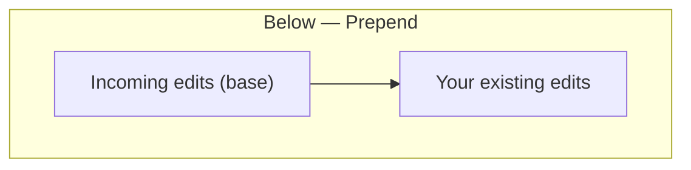
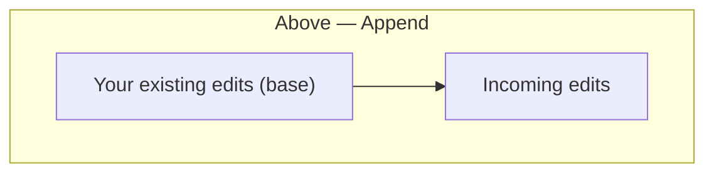
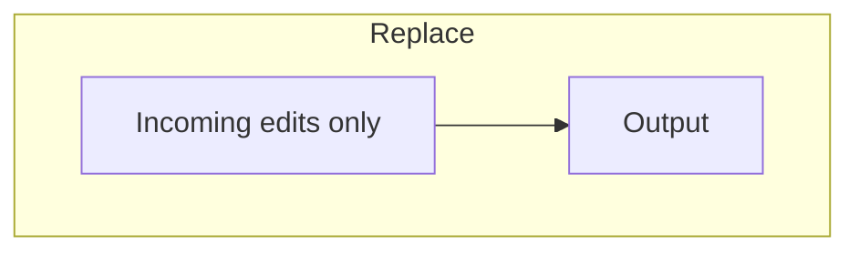

Transfer the editing recipe from one image to one or many others. The result is a **merge** of the source history into each destination image — not a blind overwrite — which means you have fine-grained control over how conflicts between the two histories are resolved.

Copy-paste is available from the **Edit** menu in any view, and the keyboard shortcuts work in both the lighttable and the darkroom.


The current darkroom image cannot be a paste target: Ansel applies the paste to the live in-memory pipeline, which would cause conflicts with the undo stack. The darkroom image is silently excluded from the destination list when you paste.


## Copying a history

### Copy all (Ctrl+C)

**Edit → Copy history (all)** records the entire editing recipe of the single selected image into a clipboard. The clipboard persists for the duration of the session.

The source image must be saved to the database before the clipboard is filled. If you are in the darkroom and the image has unsaved in-progress edits, Ansel flushes those to the database first so the clipboard always reflects what you see on screen.

### Selective copy (Ctrl+Shift+C)

**Edit → Copy history (parts)** opens a dialog listing all processing modules that are present in the source image's history. Tick or untick individual modules to choose exactly which parts of the recipe you want to transfer. Only the ticked modules will be pasted.

## Pasting a history

### Paste all (Ctrl+V)

**Edit → Paste history (all)** applies the entire clipboard to all selected images. If **Ask merge settings before paste** is enabled (the default), a dialog appears first so you can choose how the incoming history is integrated. See [Merge settings dialog](#merge-settings-dialog) below.

### Paste parts (Ctrl+Shift+V)

**Edit → Paste history (parts)** opens the same module-selection dialog as selective copy, but this time against the clipboard contents. Tick the modules you want to paste, then click OK. The merge settings dialog appears next (if enabled).

## Merge settings dialog

Because each destination image already has its own editing history, pasting is a **merge** operation. The dialog gives you two independent choices each time you paste (or lets you save a default and skip the dialog).

### Merge position

Controls how the incoming history is placed relative to the destination's existing history. Since the processing pipeline is applied from the bottom up (early modules run first, later modules override), placement determines which side wins when the same module appears in both histories.

Below (Prepend)
: The incoming history is inserted **before** your existing edits in the processing stack. Your current edits run later and therefore **override conflicts**. Use this when you want to apply a baseline recipe while keeping your personal adjustments on top.

Above (Append)
: The incoming history is inserted **after** your existing edits. The incoming edits run later and therefore **override conflicts**. Use this when the source image carries corrections (e.g. a colour calibration) that should take precedence over what is already in the destination.

Replace
: Your existing history is discarded entirely and replaced with the incoming one. No conflict resolution is needed because nothing is kept from the destination.

### Use incoming pipeline order

The _pipeline order_ is the spatial order in which processing modules execute — independent from the temporal history stack. When checked, the module execution order is taken from the source image. When unchecked, your current pipeline order is preserved.


The pipeline order matters when you have reordered modules from their defaults (e.g. moved _colour calibration_ before _exposure_). Copying pipeline order from an image with a different arrangement will resequence your pipeline.


### Ask me every time

When checked, this dialog appears every time you paste. When unchecked, the current settings are used silently. You can still change the saved defaults at any time via **Edit → History pasting mode** and **Edit → Nodes pasting mode**.

## Default settings (Edit menu)

The merge settings persisted between sessions are controlled by two submenus in the Edit menu:

**Edit → History pasting mode** sets the default merge position:

- **Prepend** — below mine, my edits win
- **Append** — above mine, incoming wins
- **Replace** — discard destination history

**Edit → Nodes pasting mode → Copy module order** toggles whether the source pipeline order is copied.

**Edit → Ask merge settings before paste** toggles whether the dialog is shown before each paste operation.

These defaults are used silently when **Ask me every time** is disabled, and are pre-filled in the dialog when it is shown.


Copy-paste and [styles](../toolboxes/styles.md) each maintain **independent** merge settings. Changing the paste defaults here has no effect on style application, and vice versa.


## Workflow examples

### Propagating a colour calibration to a batch

1. Edit one image: apply _colour calibration_, _exposure_, and _tone equalizer_.
2. **Edit → Copy history (parts)** and tick only _colour calibration_.
3. Select the rest of the batch in the lighttable.
4. **Edit → Paste history (parts)**, choose **Above mine** so the calibration overrides any existing per-image settings.

### Sharing a base recipe across a project

1. Develop one image to the look you want for the whole project.
2. **Edit → Copy history (all)**.
3. Select all images from the same session.
4. **Edit → Paste history (all)**, choose **Below mine** so per-image exposure adjustments you add later will override the shared base.

### Resetting to a clean slate

1. Copy from an image that has only the default pipeline (no edits).
2. **Edit → Paste history (all)**, choose **Replace**.

This is equivalent to **Edit → Delete history** but lets you keep the default module activations from a specific image rather than from Ansel's built-in defaults.

## Keyboard shortcuts

| Action | Shortcut |
|---|---|
| Copy history (all) | Ctrl+C |
| Copy history (parts) | Ctrl+Shift+C |
| Paste history (all) | Ctrl+V |
| Paste history (parts) | Ctrl+Shift+V |
