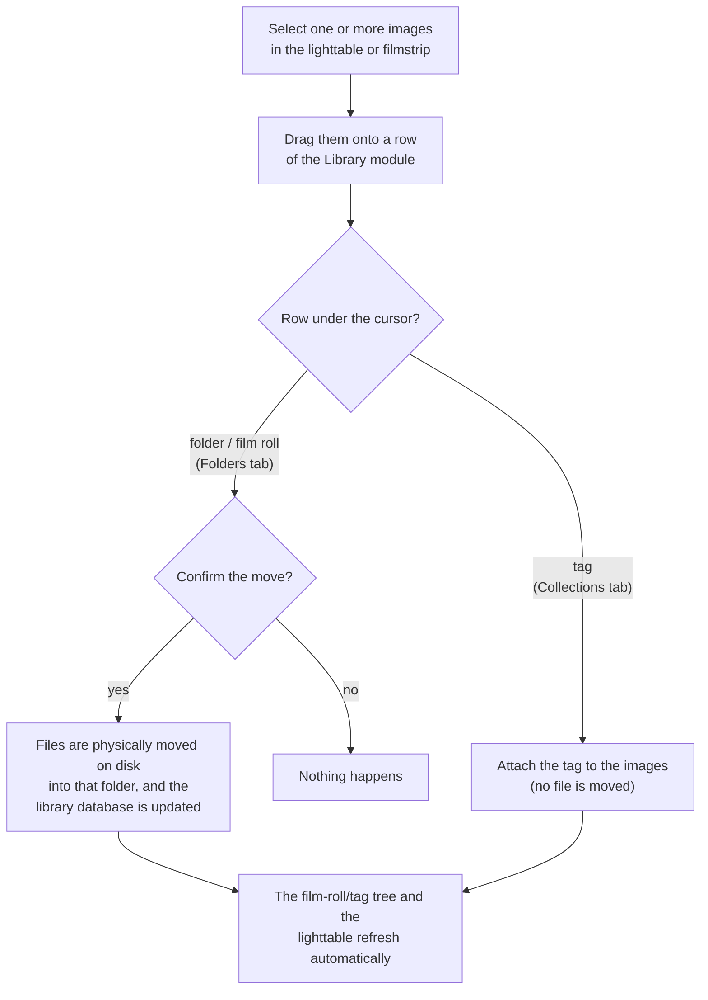

Filter the images shown in the lighttable view and filmstrip panel using image attributes. This set of filtered images is known as a _collection_.

Importing images into Ansel stores information about them (filename, path, Exif data, data from XMP sidecar files etc.) in Ansel's library database. A collection is defined by applying filtering rules to these attributes, thus creating a subset of images to display in the lighttable view and the filmstrip module.

The default collection is based on the _film roll_ attribute and displays all images of the last imported or selected film roll.


We carry the ~~burden~~ legacy of Darktable here, that makes a weird difference between _film rolls_ and _folders_.

When importing an image into Ansel's library, its parent folder is saved as a property of the image named _film roll_. At any given time, when we query the content of a _film roll_, we list all the pictures that Ansel knows of (imported in library) that were imported from that folder.

It means that Ansel never check the content of the actual filesystem folder after the images have been imported: it may contain more images than what the library is aware of, or the images may have been deleted or moved elsewhere on the filesystem, or the whole folder might have been deleted entirely. So Ansel _film roll_ is not directly equivalent to filesystem folder, even if it's related and linked at import time.

Now, where it gets confusing: what Darktable called _folders_ is actually just _film rolls_ but displayed as a treeview instead of a flat list. Yet _folders_ are listed as a different querying option as _film rolls_, suggesting that it's a different piece of data, though it is only the same content presented differently.

Ansel solves this in the _Folders_ tab: Darktable's _film rolls_ or _folders_ are presented as a _list_ or _treeview_ display option, and that's the end of the story. However, they remain separate objects in the (advanced) _Queries_ tab. 


## The three tabs

The Library module is organised in three tabs, each tuned to a different way of building a collection. The tabs share a single value list (the box at the bottom that shows the available values for the active attribute, along with the image count for each value).

Folders
: Browse and manage the folders and film rolls known to Ansel. The _View_ selector at the top of this tab switches between a flat **List** of film rolls and a hierarchical **Tree** of folders. This is the tab where you relocate or remove film rolls (one at a time or in batches). It corresponds to a single _film roll_ or _folder_ rule.

Collections
: Browse and manage your tags, shown as a hierarchical tree. Besides selecting images by tag, this is where you rename or delete tags (in batches). It corresponds to a single _tag_ rule.

Queries
: Build an arbitrary collection from one or more rules, combining any of the image [attributes](#filtering-attributes) with logical operators. This tab also exposes a [raw SQL](#raw-sql-queries) escape hatch for power users.

Switching tabs only reconfigures the controls and refreshes the value list; it does not re-run the collection query. The collection is only rebuilt when you actually click a value or edit a rule.

## Filtering attributes

The images in a collection can be filtered using the following image attributes. All of them are available in the _Queries_ tab; the _Folders_ and _Collections_ tabs are pre-set to the folder/film-roll and tag attributes respectively.

### Files

film roll
: The name of the film roll to which the image belongs (which is the same as the name of the folder in which the image resides). In the _Folders_ tab, choose **List** in the _View_ selector to browse film rolls. Right-click a film roll to remove its contents from the Ansel library, or to tell Ansel that its location has changed in the file system (see [updating the folder path of moved images](#updating-the-folder-path-of-moved-images)).

folder
: The folder (file path) where the image file is located. In the _Folders_ tab, choose **Tree** in the _View_ selector to browse the folder hierarchy. Click a folder to select its images; enable the **include sub-folders** checkbox to also include every image located in its sub-folders. Right-click a folder to remove its contents from the Ansel library or to relocate it.

filename
: The image's filename.

### Metadata

tag
: Any tag that is attached to the image. Untagged images are grouped under the "not tagged" entry. Tags are displayed as a hierarchical list.

title
: The image's metadata “title” field.

description
: The image's metadata “description” field.

creator
: The image's metadata “creator” field.

publisher
: The image's metadata “publisher” field.

rights
: The image's metadata “rights” field.

notes
: The image's metadata "notes" field.

version name
: The image's metadata "version name" field.

rating
: The image's star rating.

color label
: Any color label attached to the image ("red", "yellow", "green", "blue", "purple").

geotagging
: The geo location of the image (see [locations](./locations.md)).

### Times

date taken
: The date the photo was taken, in the format `YYYY:MM:DD`.

date-time taken
: The date & time the photo was taken, in the format `YYYY:MM:DD hh:mm:ss`.

import timestamp
: The date/time the file was imported, in the format `YYYY:MM:DD hh:mm:ss`.

change timestamp
: The date/time the file's history stack was last changed, in the format `YYYY:MM:DD hh:mm:ss`.

export timestamp
: The date/time the file was last exported, in the format `YYYY:MM:DD hh:mm:ss`.

print timestamp
: The date/time the file was last printed, in the format `YYYY:MM:DD hh:mm:ss`.

### Capture details

camera
: The Exif data entry describing the camera make and model.

lens
: The description of the lens, as derived from Exif data.

aperture
: The aperture, as derived from Exif data.

exposure
: The shutter speed, as derived from Exif data.

focal length
: The focal length, as derived from Exif data.

ISO
: The ISO, as derived from Exif data.

### Ansel

grouping
: Choose between "group followers" and "group leaders".

local copy
: Show files that are, or are not, copied locally.

history
: Choose images whose history stacks have been altered or not.

module
: Filter based on the processing modules that have been applied to the image.

module order
: Choose images with "v3.0", "legacy" or "custom" module orders.

## The Folders tab

view selector
: The combobox at the top toggles between a flat **List** of film rolls and a hierarchical **Tree** of folders.

include sub-folders
: When the _Tree_ view is active, this checkbox controls whether clicking a folder also includes the images contained in all of its sub-folders. Internally it appends a `*` wildcard to the folder path; if you type a path ending in `*` or `%` by hand, the checkbox updates itself to stay in sync.

sort by / sort direction
: Choose whether film rolls are ordered by **name** (folder path) or by **id** (roughly the order in which they were first imported), and toggle ascending/descending order. These controls only affect the flat **List** view (the **Tree** is always sorted by path), so they are hidden in the Tree view.

folder levels
: The number of folder levels shown in film-roll names, counting from the right. Only meaningful (and only shown) in the **List** view.

You can **drag images** from the lighttable/filmstrip and drop them onto a folder or film-roll row to physically move the files into that folder (see [drag and drop](#drag-and-drop)).

Right-click a folder or film-roll row for management actions: **remove from library…**, **relocate…**, or **pre-render thumbnails** (fills the on-disk thumbnail cache for every image in the selected folders, as a background task).

## The Collections tab

This tab lists your tags as a hierarchical tree. Click a tag to filter the collection by it:

- **click** a tag to include that tag *and* all of its sub-tags (appends the `*` suffix);
- **shift+click** to include only the exact tag, not its sub-tags (no suffix);
- **ctrl+click** to include only the sub-tags, excluding the tag itself (appends the `|%` suffix).

You can **drag images** from the lighttable/filmstrip and drop them onto a tag row to attach that tag to them (see [drag and drop](#drag-and-drop)).

Right-click a tag to **rename** it, to **delete** one or more selected tags (deleting a tag also detaches it from every image), or to **pre-render thumbnails** of the tagged images.

no 'uncategorized' group
: When enabled, tags that have no children are not grouped under a synthetic "uncategorized" entry.

## The Queries tab

This tab is the general-purpose collection builder.

### Defining filter criteria

Each rule is made of an attribute selector, an optional comparison operator, and a search field:

image attribute
: The combobox on the left chooses which [attribute](#filtering-attributes) the rule filters on.

comparison operator
: For numeric, date/time and rating attributes, a small operator selector appears between the attribute and the search field, offering `=`, `<`, `≤`, `>`, `≥` and `≠`. It is hidden for text attributes.

search pattern
: In the text field, write a matching pattern. This pattern is compared against all database entries with the selected attribute, matching if the attribute *contains* the pattern. Use `%` as a wildcard. Leave the field empty to match all images that have the attribute. Where applicable, a tooltip appears when you hover over the attribute or the search field.

: Numeric and date/time attributes can also be combined with the comparison operators above, or with a range expressed as `[from;to]` (inclusive on both ends).

select by value
: Instead of typing, you can pick from the value list below the search field. It shows the values of the selected attribute that are present in the currently-matching images, with the image count for each, and updates continuously as you type. Clicking a value populates the search field automatically. For numeric and date-time attributes you can select a range of values by clicking the first and last entries.

### Combining multiple filters

You can combine several rules to build more complex collections. Each rule beyond the first carries a logical operator that defines how it combines with the rules above it.

Click the button at the end of a rule row to open a menu:

clear this rule
: Remove the current rule, or reset it if it is the only rule defined.

narrow down search
: Add a new rule combined with the previous rule(s) using a logical **AND**. An image is kept only if it *also* satisfies the new criteria.

add more images
: Add a new rule combined with the previous rule(s) using a logical **OR**. Images that satisfy the new criteria are *added* to the collection.

exclude images
: Add a new rule combined with the previous rule(s) using a logical **AND NOT** (except). Images that satisfy the new criteria are *removed* from the collection.

The button of each non-final rule shows its current operator (**AND**, **OR** or **AND NOT**). Click it to change the operator for that rule.

### Raw SQL queries

For advanced needs that the rule builder cannot express, enable **edit as raw SQL** on the _Queries_ tab. This directly exposes the SQL backend that is actually used underneath the GUI in other modes, where the GUI only builds SQL queries from more user-friendly (and standardized) controls.

The text field then accepts a single SQL `WHERE` expression that is injected directly into the collection query against your *local* library database. Press <kbd>Enter</kbd> to run it.

This is a power-user escape hatch:

- The expression is **not** sanitised — it is your responsibility to write valid SQL.
- It is **read-only**: the expression can only filter rows, it cannot modify the database.
- A malformed expression makes the underlying query fail gracefully and yields an **empty collection**; it does not crash Ansel.
- Enabling raw SQL replaces all the rules currently defined in the _Queries_ tab. Disabling it returns to a single empty film-roll rule.

Your expression is evaluated against one row per image. The following columns are available directly (they come from the `images` table); their names, SQL types and meaning are:

| Column             | Type    | Meaning |
|--------------------|---------|---------|
| `id`               | INTEGER | Unique image id (primary key). |
| `group_id`         | INTEGER | Id of the group-leader image. An image is a group leader when `id = group_id`. |
| `film_id`          | INTEGER | Id of the film roll (folder) the image belongs to. |
| `filename`         | TEXT    | File name with extension, without the path (e.g. `IMG_1234.CR2`). |
| `maker`            | TEXT    | Camera manufacturer, from Exif. |
| `model`            | TEXT    | Camera model, from Exif. |
| `lens`             | TEXT    | Lens description, from Exif. |
| `aperture`         | REAL    | f-number, e.g. `2.8`. |
| `exposure`         | REAL    | Shutter speed **in seconds**, e.g. `0.004` for 1/250 s. |
| `focal_length`     | REAL    | Focal length in millimetres. |
| `iso`              | REAL    | ISO sensitivity. |
| `aspect_ratio`     | REAL    | Width / height after cropping. |
| `flags`            | INTEGER | Bit-field. Bits 0–2 (`flags & 7`) hold the star rating 0–5; bit 3 (`flags & 8`) marks a rejected image; the remaining bits are internal (local copy, etc.). |
| `version`          | INTEGER | Duplicate/version number (`0` for the original). |
| `position`         | INTEGER | Manual ordering index used by the lighttable. |
| `datetime_taken`   | INTEGER | Capture date/time, as microseconds since `0001-01-01 00:00:00`. `0` means unknown. |
| `import_timestamp` | INTEGER | Import date/time, same microsecond encoding. `-1` means never. |
| `change_timestamp` | INTEGER | Last history-change date/time, same encoding. `-1` means never. |
| `export_timestamp` | INTEGER | Last export date/time, same encoding. `-1` means never. |
| `print_timestamp`  | INTEGER | Last print date/time, same encoding. `-1` means never. |

Examples:

```sql
iso > 800 AND lens LIKE '%50mm%'
```

```sql
aperture <= 2.8 AND exposure < 0.004
```

Because the date/time columns are stored as integer microseconds, filtering on them in raw SQL is awkward — for date ranges, prefer the dedicated _date taken_, _import timestamp_, etc. rules of the standard builder, which accept human-readable `YYYY:MM:DD` text.

The columns above are the ones exposed directly to the expression. Attributes that live in other tables (tags, metadata, color labels, edit history, folder paths) are not columns of this row, but you can still reference them through a sub-query on the image `id`. The relevant library tables are:

- `main.tagged_images(imgid, tagid)` joined with `data.tags(id, name, synonyms)` — tags;
- `main.meta_data(id, key, value)` — title, description and the other text metadata;
- `main.color_labels(imgid, color)` — color labels (`0`=red, `1`=yellow, `2`=green, `3`=blue, `4`=purple);
- `main.history(imgid, operation, …)` — applied modules / edit history;
- `main.film_rolls(id, folder)` — film-roll folder paths.

For example, to select images tagged under `landscape`:

```sql
id IN (SELECT imgid FROM main.tagged_images ti
       JOIN data.tags t ON t.id = ti.tagid
       WHERE t.name LIKE 'landscape%')
```

## Drag and drop

You can drag images out of the lighttable or the filmstrip and drop them directly onto a row of the Library module. What happens depends on the kind of row you drop them on — a folder/film-roll row, or a tag row:



The drop always applies to the single row located **under the mouse cursor** when you release the button, regardless of which rows happen to be selected.

drop on a folder or film roll
: The dragged images are **physically moved on disk** into that folder (a film roll is created for the folder if one does not exist yet), and the library is updated to match. Because this touches the file system, you are asked to confirm first. Any duplicates of the moved images follow along.

drop on a tag
: The tag of the row is **attached** to the dragged images. This only edits metadata — no file is moved on disk — and the change is written to the images' XMP sidecars.


Drag and drop only works from Ansel's own lighttable/filmstrip (it relies on the internal image identifiers). Dragging image files from an external file manager into this module is not supported — use the regular import for that.


## Updating the folder path of moved images

While it is best not to touch imported files behind Ansel's back, this module can help you recover when you have moved or renamed image folders after importing them. The process is:

1. Open the _Folders_ tab.
1. A film roll or folder whose location can no longer be found on disk is shown with ~~strikethrough~~ formatting.
1. Right-click the folder or film roll name and select **relocate…**, then choose the new location of the folder. Selecting several rows first lets you relocate them in one operation by picking their new common parent folder.

This updates Ansel's library database only; it does not move any files on disk.

## Returning to a previous collection

Your recent collections are kept in a history list. You can revert to a previously-defined collection from the **collections** entry in the top menu bar, which lists the most recent collections you have used. The number of remembered collections is configurable from the preferences of that recent-collections list (**number of collections to be stored**).

## Settings

The Library module no longer hides its settings behind a separate "preferences…" popup: every setting now lives directly in the relevant tab.

do not set the 'uncategorized' entry for tags
: The **no 'uncategorized' group** checkbox on the _Collections_ tab. When enabled, tags that have no children are not grouped under a synthetic "uncategorized" entry (default off).

number of folder levels to show in lists
: The **folder levels** spinner on the _Folders_ tab (List view). The number of folder levels to show in film-roll names, counting from the right (default 1).

sort film rolls by
: The **sort by** selector on the _Folders_ tab (List view). Sort film rolls by either their **name** (folder path) or **id** (roughly equivalent to the date the film rolls were first imported) (default "id").

sort collection descending
: The **sort direction** toggle on the _Folders_ tab. Sorts "film roll" (when sorted by folder), "folder", and date/time attributes (e.g. date taken) in descending order (default on).
