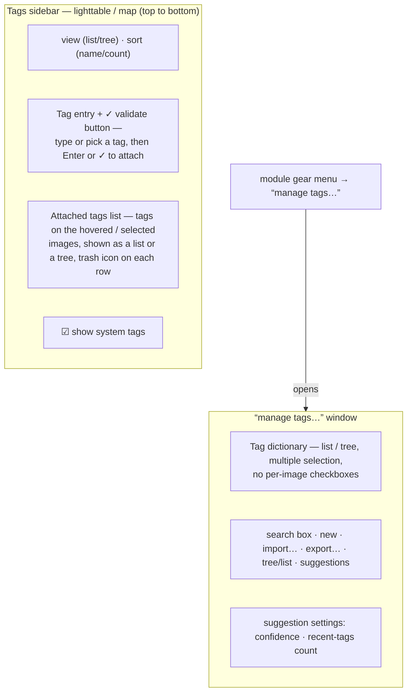

Attach tags to images, and manage the tag dictionary.

Tags provide a means of adding information to images using a keyword dictionary. You can also manage tags as a hierarchical tree, which can be useful when their number becomes large.

Tags are physically stored in [XMP sidecar files](../lighttable/digital-asset-management/sidecar.md) as well as in Ansel's library database and can be included in [exported](./export.md) images.

In Ansel, attaching tags is also _the_ way to build [collections](./collections.md): a collection is the dynamically-queried set of all images sharing a given tag, always kept up to date. So the everyday job of this module — attaching a tag to images — is the same act as “putting images into a collection”. The tag _dictionary_ itself (creating, renaming, deleting, importing and exporting tags) is a separate, occasional, housekeeping task and lives in its own window.

## Definitions

The following definitions assume that you have set up a single tag named "`places|France|Nord|Lille`".

tag
: A tag is a descriptive string that may be attached to an image. A tag can be a single term or a sequence of connected terms forming a path, separated by the pipe symbol. For example, "`places|France|Nord|Lille`" defines a single tag, where each term in the path forms a smaller subset of those before it. You can attach as many tags to an image as you like.

: You can assign properties (name, private, category, synonyms and image order) to a tag.

node
: Any path that forms part of a tag is a node. In the above example, "`places`", "`places|France`", "`places|France|Nord`" and "`places|France|Nord|Lille`" are all nodes. In the hierarchical tree view, the nodes form the branches and leaves of the tree.

free node
: Any node that is not explicitly defined as a tag is called a free node. In the above example, "`places`", "`places|France`" and "`places|France|Nord`" are all free nodes. You cannot set any properties, except “name”, for a free node and you cannot add a free node to an image. See the “multiple tags” section below for more information.

category
: Any tag can be flagged by the user as being a “category”.

## Multiple tags

The above definitions considered a simple example – a single tag and its properties. Consider instead the scenario where the following four pipe-delimited tags are each separately defined in Ansel.

```
places|France|Nord|Lille
places|France|Nord
places|France
places|England|London
```

In this case the nodes are

```
places
places|France
places|France|Nord
places|France|Nord|Lille
places|England
places|England|London
```

The only free nodes are "`places`" and "`places|England`". Both of these free nodes are also (by implication) categories.

You can attach any of these tags to any image. Any tags attached to an image, except category tags, can be included when that image is [exported](./export.md).

If you attach the "`places|France|Nord|Lille`" tag to an image, the "`places|France|Nord`" and "`places|France`" tags are also implicitly attached to that image (you don’t need to attach them manually). Note that this is only true here because those additional tags have been separately defined -- the "`places`" node is not included because it is a "free node" (not a tag).

## Module layout

The tagging experience is split across two surfaces, matching the two distinct jobs of culling (fast, frequent) and dictionary maintenance (occasional):



The **sidebar toolbox** (the _Tags_ module in the left panel) is for the “one image → many tags” workflow: it shows the tags already on the current image and lets you attach more. The **manage tags window** is for the dictionary itself (create / rename / delete / import / export) and its suggestion settings. It never attaches anything to your images — it only edits the tags. Open it from the module's gear (preset) menu → **manage tags…**.

### Sidebar toolbox

From top to bottom, the sidebar contains:

- **Display controls** — a row with two combo boxes:

  view
  : Chooses how the attached list below is rendered: **list** shows each tag as its whole `a|b|c` path on one line; **tree** breaks the paths on the pipe `|` and shows them hierarchically, so common parents are grouped.

  sort
  : Chooses whether to order the attached tags by **name** (alphabetically) or by **count** (how many of the targeted images carry each tag).

- **Tag entry** — a text box where you type or pick a tag to attach. As you type, an autocompletion list of matching existing tags appears below it; pick one with the arrow keys/mouse, or keep typing a brand-new name. A small clear (✕) icon inside the box empties it.

   **validate** — the check-mark button to the right of the entry attaches the typed (or picked) tag to the target images, exactly like pressing Enter. It is there so that, after choosing a tag from the autocompletion list with the mouse, you do not have to reach for the keyboard.

- **Attached tags list** — the tags attached to the image(s) currently under your mouse cursor (if hovering over an image in the lighttable), or to the currently selected image(s) (if not hovering). Each user tag row carries a trash icon on its right that detaches that single tag in one click. Automatically generated Ansel system tags (with names starting “`Ansel|`”) are shown for information only — only when _show system tags_ is enabled — and have no trash icon. The number in brackets next to a tag indicates how many of the targeted images carry it. You can adjust the height of this list by holding Ctrl and scrolling with your mouse wheel. The list is rendered as a flat list or a hierarchical tree according to the _view_ control above (see [Detach tag](#detach-a-tag) for the right-click actions).

- **show system tags** — a checkbox at the bottom that reveals the system tags Ansel manages automatically (the `Ansel|…` family). They are hidden by default.

The [manage tags window](#manage-tags-window) is opened from the module's gear (preset) menu, not from the sidebar.

### Manage tags window

Open this window from the module's gear (preset) menu → **manage tags…**. It is a separate window dedicated to maintaining the dictionary, and contains:

- a **search box** at the top that filters the tag list as you type (its ✕ icon clears it);
- the **tag dictionary**, listing every tag known to Ansel, either as a flat _list_ or as a hierarchical _tree_. Multiple tags can be selected at once (Ctrl-click / Shift-click) for bulk operations;
- a row of buttons:

  new
  : Create a new tag using the name typed in the search box.

  import...
  : Import tags from a Lightroom keyword file.

  export...
  : Export the whole dictionary to a Lightroom keyword file.

   suggestions
  : Show a list of suggested keywords based on the keywords already associated with the selected images (see the _suggestion settings_ below). CAUTION: this view queries the database so it might be slow.

   list/tree
  : Toggle the dictionary between the flat _list_ view and the hierarchical _tree_ view.

- the **suggestion settings** (formerly a separate _preferences_ dialog), applied immediately:

  suggested tags level of confidence
  : Level of confidence used to include a tag in the suggestions list (default 50):
  : - 0: display all associated tags,
  : - 99: match tags with a 99% confidence level,
  : - 100: an essentially unreachable level of confidence, so no matching tags are returned. Use 100% to disable the best-matched suggestions list (faster).

  number of recently attached tags
  : Number of recently attached tags to include in the suggestions list (default 20). A value of "-1" disables the most-recently-attached suggestions list.

In the hierarchical _tree_ view, a name in italics represents either a free node or a category. You can adjust the height of the dictionary by holding Ctrl while scrolling with your mouse wheel.

All other dictionary operations (rename, change path, delete, “set as a tag”, navigation to a tag collection, …) are reached by right-clicking a tag — see [Usage](#usage) below.


The management window only edits the tag dictionary; it cannot attach tags to images. To attach a tag, use the sidebar entry, the quick-tag box (Ctrl+T), or drag images onto a tag row in the [collections](./collections.md) tab of the _Library_ module.


## Usage

### Attach a tag

To attach an existing or new tag to the image(s) under the cursor (or, failing that, the selected images):

- Type its name in the sidebar **tag entry** — picking from the autocompletion list if it already exists — then press Enter or click the **✓ validate** button. Hierarchical tags are created using the pipe symbol “`|`” to separate nodes. If the tag does not yet exist it is created, then attached.
- Press **Ctrl+T** to open a small text box at the bottom of the central lighttable view, type a tag name and press Enter. The tag is created if needed and attached to all the selected images.
- **Drag** an image or group of images from the lighttable/filmstrip and **drop them onto a tag row** in the [collections](./collections.md) tab of the _Library_ module. This attaches that tag to the dragged images (no file is moved).

For a tag that is attached to only _some_ of the targeted images (shown with a count lower than the number of images), right-click it in the attached list and choose **attach tag to all** to extend it to every targeted image.

When hovering over images in the lighttable you can check which tags are attached either in the attached list here, or in the _tags_ attribute of the [image information](./image-information.md) module.

### Detach a tag

From the **attached tags** list in the sidebar:

- click the **trash icon** on the tag's row to detach that one tag;
- **double-click** a tag to detach it;
- select one or several tags and press the **Delete** / Backspace key;
- select one or several tags, **right-click**, and choose **detach tag(s)** to detach them all in one go;
- **right-click anywhere** in the list (even on empty space) and choose **detach all tags** to remove every tag from the targeted images at once.

### Create a tag

There are several ways to create a new tag:

- _Type into the sidebar entry and press Enter (or ✓)._ The tag is created and attached to the target images in one step.
- _Use “create tag…”_ in the dictionary's right-click menu (manage tags window). The tag is created under the selected node (hierarchical) or at the root, and is **not** attached to any image.
- _Use “set as a tag”_ in the right-click menu to turn a free node (e.g. “`places|England`”) into a real tag, so that it gets implicitly attached to all images carrying its sub-tags (e.g. “`places|England|London`”).
- _Import a Lightroom keyword text file_ (the _import…_ button). Existing tags are updated, new ones are created. You can export your tags, edit the file, and re-import it.
- _Import already-tagged images._ Tags found in imported images are added to the dictionary (no opportunity to rename or re-categorize them during import).

A number of tags are generated automatically by Ansel for certain actions — for example “`Ansel|exported`” and “`Ansel|styles|your_style`” identify images that have been exported or had a style applied.

### Edit / rename a tag

In the manage tags window, right-click a single tag:

edit…
: Change the tag's name (you cannot move it to another node here — the pipe “`|`” is not allowed in this field), and set its _private_ and _category_ flags and its _synonyms_. The command is aborted if the new name already exists. These attributes are recorded in the `XMP-dc Subject` and `XMP-lr Hierarchical Subject` metadata. Which tags end up in exports is controlled in the [export](./export.md) module.

: - A tag set as “private” is, by default, not exported.
: - A tag set as “category” is not exported in `XMP-dc Subject`, but is exported in `XMP-lr Hierarchical Subject` (which holds the organization of your tags).
: - “synonyms” enrich the tag information and mainly assist search engines — e.g. “juvenile”, “kid” or “youth” as synonyms of “child”. They can also be used to translate tag names to other languages.

change path…
: Available in _tree_ view only. Lets you change the full path of a node, including the nodes it belongs to (use the pipe “`|`” to specify the hierarchy). The dialog shows how many tagged images would be impacted. This is powerful but can significantly rewrite your images' metadata, so use it carefully. The operation is aborted if it would conflict with an existing tag.

A quick way to reorganize the structure is **drag and drop** of nodes in the _tree_ view: drag any node and drop it onto another node to make it (and its descendants) a child of the target. Dragging over a node opens it automatically (drag over the node's selection indicator to avoid opening it). Drop a node onto the top of the window to move it to the root level. Conflicting moves are aborted.

The “copy to entry” right-click item copies the selected tag into the search box, so you can tweak its name and use _new_ to create a similar tag.

### Delete a tag

Deleting a tag removes it from **all** images (selected or not) and from the database. Because this can impact many images, a confirmation dialog shows how many images are affected. **Take this warning seriously — there is no undo** (short of restoring your database and/or XMP sidecars from a backup).

In the manage tags window:

- right-click a tag and choose **delete tag**;
- select **several** tags (Ctrl-click / Shift-click) and right-click → **delete tags** to remove them all after a single confirmation;
- right-click a branch node and choose **delete node** to delete that node together with all its child tags.

Tags can also be deleted (and renamed) from the [collections](./collections.md) tab of the _Library_ module.

### Import / export

The **import…** button reads a text file in the Lightroom tag file format: existing tags are updated, missing ones are created. The **export…** button writes the entire dictionary to such a file. Round-tripping (export, edit, re-import) is a convenient way to bulk-edit tags.

### Keyboard

- In the sidebar entry, **Enter** attaches the typed/picked tag (creating it if needed). **Shift+Tab** moves focus to the first user tag in the attached list.
- In the attached list, **Tab** returns focus to the entry; **Delete** / **Backspace** detaches the selected tag(s).
- In the manage tags window, the dictionary's **Left/Right** arrows collapse/expand the selected node in _tree_ view; **Tab** / **Shift+Tab** move focus to/from the search box.

### Navigation

To see the images carrying a particular tag, right-click it in the manage tags window and choose **go to tag collection**. This opens a [collection](./collections.md) showing all images with that tag.

Choose **go back to work** from the same menu to return to the collection you had open before, as long as you have not selected another collection in the meantime.
